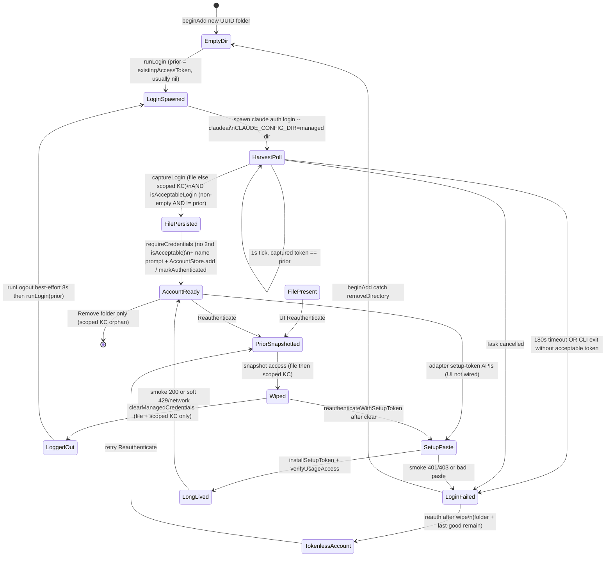
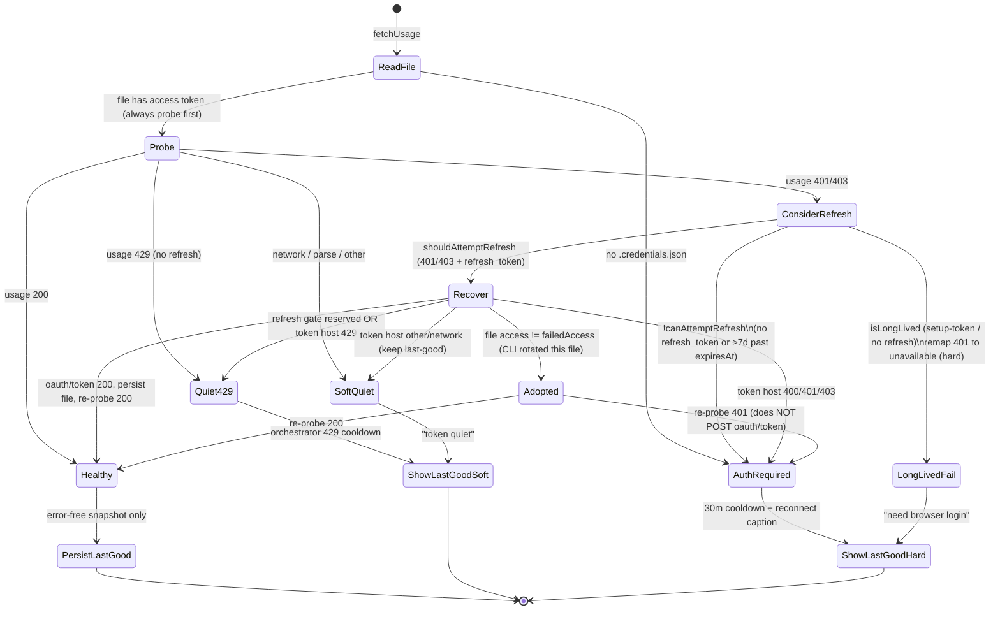

# Claude auth state graph (audit)

Inspected `feat/v1-implementation` @ `8148deb` (reauth requires new token) + `20e4ed1` (last-good + harvest).
Sources: `Sources/Adapters/ClaudeAdapter.swift`, `Sources/Island/EdgeAddChrome.swift`, `Sources/AppCore/UsageOrchestrator.swift`, `Sources/Domain/UsageSnapshotMerge.swift`, `Sources/Infra/CredentialStore.swift`, `Tests/ClaudeAdapterTests.swift`.

No live Anthropic calls. No writes to the user’s default `Claude Code-credentials` item.

## Storage model (one account)

| Store | Service / path | When touched |
| --- | --- | --- |
| Managed file (SoT after harvest) | `accounts/<uuid>/.credentials.json` | persist after add/reauth/refresh/setup-token; poll/refresh read **only** this |
| Scoped Keychain (login harvest only) | `Claude Code-credentials-<sha256(CLAUDE_CONFIG_DIR)[0:8]>` account=`NSUserName()` | capture after `auth login`; delete on `clearManagedCredentials` |
| Last-good rings | `accounts/<uuid>/.dash-island-usage.json` | written on error-free poll; restored on launch; **not** cleared on reauth |
| Global Claude Code KC | `Claude Code-credentials` (no suffix) | **never** read or deleted by Dash |
| Process-wide refresh gate | `UserDefaults` `DashIsland.ClaudeRefreshNextAllowedAt` | 20m min gap; 3h extra after token-host 429 |

UI (`EdgeAddChrome`) only runs **browser** `beginAdd` / `reauthenticate`. `beginAddWithSetupToken` / `reauthenticateWithSetupToken` exist on the adapter but are not wired.

---

## 1. State diagrams

### 1a. Add / reauth / harvest / logout

### 1b. Probe / refresh / last-good

---

## 2. Transition table

Expected column is the **product** outcome after this event: `pass` (new usable session / live rings), `fail` (error, no account / no token), `quiet` (keep last-good, do not demand reauth), `reauth` (hard reconnect caption; rings may stay).

| From | Event | To | Expected |
| --- | --- | --- | --- |
| (none) | `beginAdd` → `createDirectory` | EmptyDir | — |
| EmptyDir | `runLogin` (prior usually nil) | LoginSpawned | browser/CLI wait |
| LoginSpawned | harvest file or scoped KC, token non-empty, prior nil | FilePersisted → AccountReady | **pass** (no usage smoke test) |
| LoginSpawned | harvest token == prior | stay HarvestPoll | keep waiting (not pass) |
| LoginSpawned | 180s / CLI exit / cancel, no acceptable token | LoginFailed | **fail** (`loginTimeout` / `credentialsMissing`) |
| FilePersisted | name Cancel / add Task cancel | folder deleted | **fail** (scoped KC **not** deleted) |
| AccountReady | UI Reauthenticate | PriorSnapshotted | progress panel, 3 min |
| PriorSnapshotted | `existingAccessToken` then `clearManagedCredentials` | Wiped | file gone; scoped KC delete attempted |
| Wiped | `runLogout` | LoggedOut | best-effort; ignore missing binary / nonzero exit |
| LoggedOut | `runLogin(priorAccess)` harvest == prior (leftover session) | stay HarvestPoll → LoginFailed | **fail** (this is the 8148deb fix) |
| LoggedOut | harvest access **≠** prior | FilePersisted → markAuthenticated | **pass** (token inequality only) |
| LoggedOut | cancel / no `claude` binary after wipe | TokenlessAccount | **fail**; last-good rings still show |
| TokenlessAccount | next `fetchUsage` | AuthRequired | **reauth** |
| AccountReady | `fetchUsage` 200 | Healthy + persist last-good | **pass** |
| AccountReady | usage 429 | Quiet429 | **quiet** |
| AccountReady | usage 401/403 + refresh_token + not 7d-stale | Recover | try adopt then oauth/token |
| Recover | `shouldAdopt` (file access ≠ failed) | Adopted → re-probe | **pass** if 200; **reauth** if 401 (no second POST) |
| Recover | gate 20m / token 429 | Quiet429 (3h global) | **quiet** |
| Recover | token 400/401/403 | AuthRequired | **reauth** |
| Recover | token other / network, previous probe had error | SoftQuiet | **quiet** |
| AccountReady | usage 401 + no refresh / hard-expired | AuthRequired | **reauth** |
| LongLived file | usage 401/403 | LongLivedFail | **reauth** (“setup-token can’t read usage”) |
| LongLived file | usage 429 | Quiet429 | **quiet** |
| (adapter only) | setup-token paste, usage 200 | LongLived AccountReady | **pass** |
| (adapter only) | setup-token paste, usage 401/403 | LoginFailed | **fail** |
| (adapter only) | setup-token paste, usage 429 / network | LongLived AccountReady | **pass** (soft keep) |
| AccountReady | Remove | folder gone | **fail** cleanup; scoped KC orphan |
| Launch | load `.dash-island-usage.json` | ShowLastGood + “checking live usage” | **quiet** until probe |
| Any error + prior last-good | `UsageSnapshotMerge.shouldRetainPreviousRings` | last-good rings stay | soft → **quiet**; hard → **reauth** caption |
| Wiped / Tokenless | last-good file still on disk | rings of **previous** identity | visual leftover (see holes) |

Helpers (pure, already tested in part):

| Helper | Accept | Reject |
| --- | --- | --- |
| `isAcceptableLogin` | non-empty access ≠ `priorAccessToken` (or prior nil) | empty, or access == prior |
| `shouldAttemptRefresh` | error is `authRequired` **and** `canAttemptRefresh` | 429 / nil error / no refresh / long-lived / >7d stale |
| `shouldAdopt` | file access ≠ `failedAccessToken` | same access, or failed is nil |
| `captureLoginCredentials` | file first, else scoped KC | never global `Claude Code-credentials` |
| `clearManagedCredentials` | delete file + scoped KC | does not logout; does not touch global KC |
| `canAttemptRefresh` | has refresh_token and not `expiresAt + 7d` | long-lived or no refresh |

---

## 3. Remaining holes (ranked)

Fixed already (do not re-litigate): file-only wipe leaving scoped KC; harvest of the **same** access token after browser flash; CLI 2.1+ writing KC-only (harvest-once); probe-first so live access survives token-host 429.

### H1 — Leftover session that **rotates** access still passes (P0)

`isAcceptableLogin` is string inequality on `accessToken` only. If `claude auth login` (or in-process leftover session) mints a **new** access token from the old refresh grant — no new user, maybe still opens a browser — reauth **passes**.

Same for `beginAdd` with `prior == nil`: any non-empty harvest is accepted, including a copy/refresh of the user’s **global** Claude Code session into the new scoped item.

**Breaks when:** CLI treats “already logged in” as success and writes a rotated blob; or global KC is the live session and `CLAUDE_CONFIG_DIR` login clones it.

### H2 — Browser add/reauth never smoke-tests `/api/oauth/usage` (P1)

`verifyUsageAccess` runs only on setup-token APIs. `beginAdd` / `reauthenticate` persist + `markAuthenticated` as soon as harvest is acceptable. A leftover-but-valid token, or a token missing `user:profile`, is a **login success**. First poll then 403 → reconnect. User already dismissed the progress panel.

### H3 — `runLogout` is fire-and-forget (P1)

No binary → return. Spawn fail → return. Exit code ignored. 8s then `terminate`. Reauth still proceeds to `runLogin`. Combined with H1, logout is not a real session barrier.

`reauthenticate` / `reauthenticateWithSetupToken` / `beginAdd` **do** call logout only on the browser reauth path. Setup-token reauth clears file+scoped KC but **does not** logout. Next browser reauth: prior = pasted token; CLI leftover OAuth (different access) is **acceptable**.

### H4 — Remove / cancel skip scoped-KC wipe and skip logout (P1)

`AccountStore.remove` and add name-cancel only `CredentialStore.removeDirectory`. Scoped `Claude Code-credentials-<sha8>` stays. UUID reuse is unlikely; the practical issue is the **CLI session** still logged in (global or scoped) for the next add/reauth (feeds H1).

### H5 — Wipe is not transactional with UI cancel (P1)

Reauth order: snapshot → **wipe** → logout → login. Cancel, `claudeBinaryNotFound`, or timeout after wipe leaves `TokenlessAccount`. Last-good rings still paint (H6). Looks signed-in until the next poll’s “reconnect account”.

`deleteScopedKeychainItem` uses `kSecAttrAccount = NSUserName()`. If the CLI uses another account attribute, wipe is a no-op and we rely entirely on H1’s token compare (same-token fail, rotated-token pass).

### H6 — Last-good is identity-blind (P2)

`.dash-island-usage.json` is not cleared on reauth, wipe, or setup-token replace. After a **different** Anthropic user succeeds (or after wipe + 429), rings show the **previous** identity. Soft 429 after a swapped session is the worst case: quiet + wrong numbers, no reconnect.

Launch restore (`restoreLastGoodSnapshots`) will also show those rings before the first probe.

### H7 — Global Claude Code KC race (P2)

Dash never reads/writes `Claude Code-credentials`. The **CLI** still might, even with `CLAUDE_CONFIG_DIR` set. Dual-refresh / session clone / logout of the user’s default Claude Code install is outside our file-only contract. We cannot unit-test this without touching that item — do not.

### H8 — Adopted-dead token skips oauth/token (P2)

`refreshThenProbe` on `.adopted` re-probes only. If the new file access also 401s, we return `authRequired` and never POST. Safer than leftover-success, but a CLI-rewritten still-dead file can skip a refresh that would have worked.

### H9 — Setup-token 429/network keeps the paste (P2)

`verifyUsageAccess` treats 429 / network / parse as soft keep. A scope-deficient `sk-ant-oat…` can be saved during an OAuth storm. Fetch later remaps 401/403 to hard “need browser login”. UI not wired today.

### H10 — `requireCredentials` does not re-check `isAcceptableLogin` (P3)

After `runLogin` returns, `requireCredentials` will persist **any** capture if the file write failed. Today `runLogin` already persisted only acceptable creds, so this is a belt-and-suspenders gap.

---

## 4. Ranked unit tests for the next worker

Pure helpers + temp directories only. **Do not** call Anthropic. **Do not** write/delete `Claude Code-credentials` (unsuffixed). **Do not** use the user’s real `accounts/` tree — use `FileManager.default.temporaryDirectory`.

If a test would need a live scoped KC item, **simulate** with a file and the already-public helpers (`existingAccessToken` file branch, `captureLoginCredentials` file branch, `isAcceptableLogin`, `clearManagedCredentials` file delete). Do not `SecItemAdd` into the login keychain.

| # | Case | Assert | Why |
| --- | --- | --- | --- |
| 1 | **Leftover same access after snapshot** | `isAcceptableLogin(old, prior: old.access) == false` even when `expiresAt` is +1h; empty access false; `prior == nil` still accepts leftover (documents beginAdd) | Regression lock for 8148deb; already partially covered — extend with future `expiresAt` explicit comment |
| 2 | **Rotated leftover is currently accepted** | `isAcceptableLogin(newAccess same refresh, prior: oldAccess) == true` | Pins H1 so a tighter policy (reject same refresh_token / require usage 200) is a deliberate test change |
| 3 | **clearManagedCredentials is file-complete** | temp dir + `.credentials.json` → `clearManagedCredentials` → `readCredentialsFile == nil` and `existingAccessToken` file branch nil | Wipe cannot leave the file that `runLogin` would short-circuit on |
| 4 | **existingAccessToken / capture file-first** | write file with access A; `existingAccessToken` == A; `captureLoginCredentials` == A; `readCredentials` does not invent a token when file missing | Harvest order; no KC write |
| 5 | **Reauth composition (file only)** | write file access A → read prior → `clearManagedCredentials` → rewrite leftover file with A → `isAcceptableLogin` false; rewrite with B → true; `requireCredentials` path via `readCredentials` after persist | End-to-end of snapshot/wipe/accept without spawning CLI |
| 6 | **Probe-first refresh gate** | table: `(error, creds) → shouldAttemptRefresh`: nil/429 → false; 401 + refresh → true; 401 + no refresh → false; 401 + long-lived flag → false; 401 + expiresAt −8d → false | Already partly tested — add long-lived + 7d stale + 403-as-authRequired |
| 7 | **Last-good never stores errors; reauth does not clear it** | `encodeLastGood(error snap) == nil`; `decodeLastGood` drops `error != nil`; write last-good, `clearManagedCredentials` (creds only) → last-good file **still present** | Locks 20e4ed1 write filter and documents H6 |
| 8 | **Setup-token paste policy** | `normalizePastedToken` short/garbage nil; `installSetupToken` in temp dir → `isLongLived`, `shouldAttemptRefresh` false; `looksLikeSetupToken` + refresh_token → **not** long-lived | Dead UI path still in adapter |
| 9 | **shouldAdopt + refreshThenProbe contract** | adopt only when failedAccess set and differs; `shouldAdopt(creds, nil) == false`; document that adopted+401 does not refresh (assert helper only unless you extract a pure step) | H8 |
| 10 | **scoped service isolation** | two temp paths → two `scopedKeychainService` strings; prefix `Claude Code-credentials-` + 8 hex; never equals unsuffixed `Claude Code-credentials` | Prevents a helper from targeting the user’s default item |

Out of scope for that worker (need CLI/HTTP/KC): live `runLogin`, `runLogout` exit codes, `deleteScopedKeychainItem` account-attribute, token-host POST, `probeUsage`.

---

## Suggested next product fixes (not this task)

1. After harvest, require usage 200 (same as setup-token) **or** require `refreshToken` present + access ≠ prior + refresh ≠ prior.
2. Treat logout + scoped delete as **required** before `runLogin`; if scoped item still readable, fail closed.
3. On account remove / add cancel / failed reauth, delete scoped KC (still never the unsuffixed default) and delete or tombstone last-good.
4. Do not `markAuthenticated` until harvest + probe pass; keep prior file until the new token is acceptable so cancel is non-destructive.
