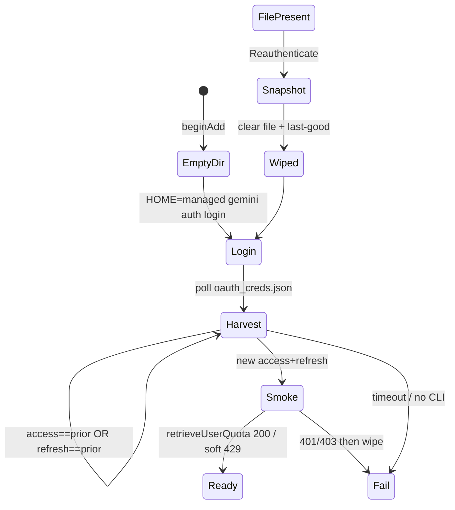

# Gemini auth state graph

Port of Claude leftover-session guards. Usage API is Orca’s
`POST cloudcode-pa.googleapis.com/v1internal:retrieveUserQuota`
after `loadCodeAssist` for `cloudaicompanionProject`.

## Storage

| Store | Path | When |
| --- | --- | --- |
| Managed creds | `accounts/<uuid>/.gemini/oauth_creds.json` | CLI writes here because `HOME` is the managed folder |
| Last-good | `accounts/<uuid>/.dash-island-usage.json` | wiped on `clearManagedCredentials` |
| Default CLI | `~/.gemini/oauth_creds.json` | **never** read or written |

## Add / reauth

## Leftover guards

- `isAcceptableLogin` rejects same access or same refresh (H1).
- Quota smoke after harvest (H2). 401/403 fail; 429/network keep.
- Failed add/reauth wipes harvest + last-good.
- Cancel/remove call `clearManagedCredentials`.
- No copy of the user’s default `~/.gemini` (that would clone the leftover session).

## Known gaps

- `gemini` CLI is not on this machine; login argv is `auth login` (Gemini CLI convention).
- No Google OAuth refresh without extracting the CLI client secret (Orca does that from the bundle). Expired access → reauth.
- Leftover that rotates **both** tokens still looks new.
